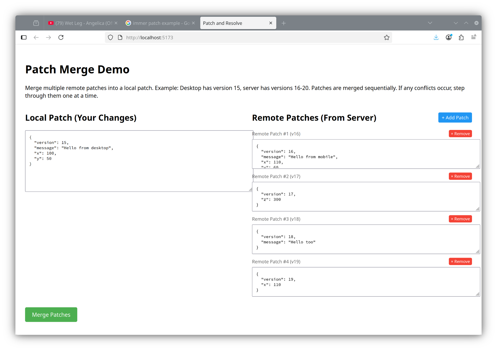
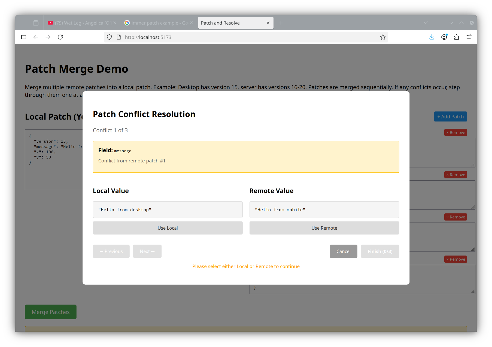
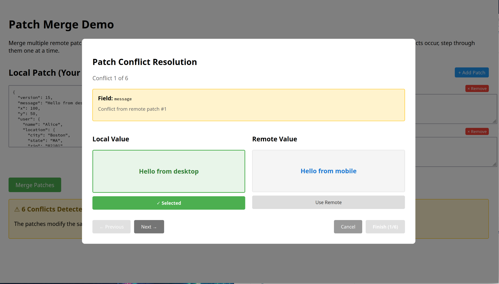
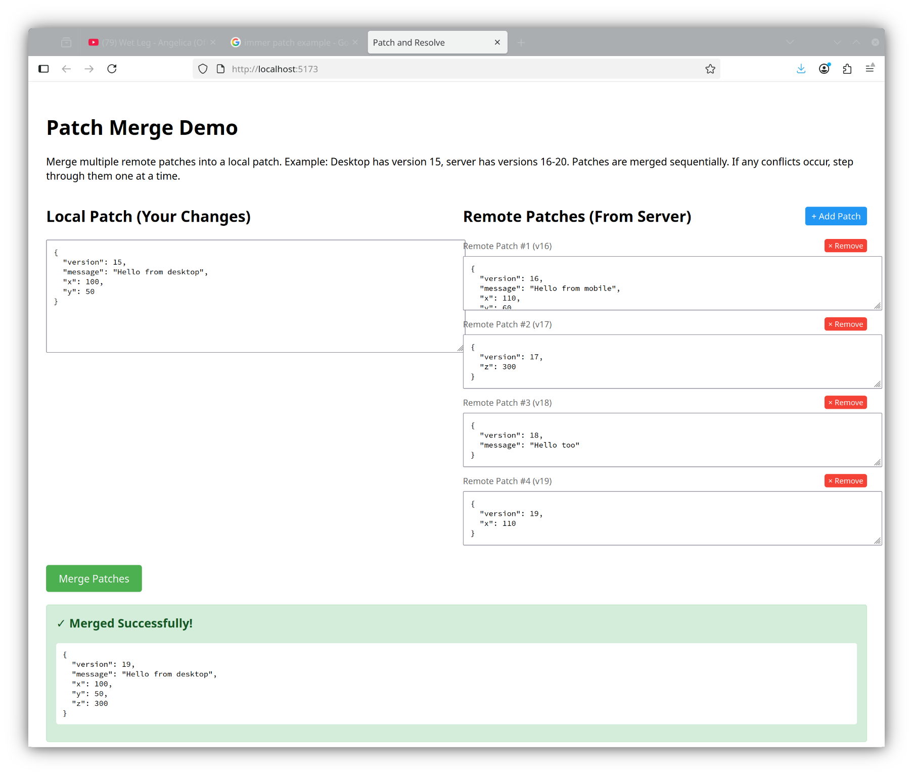

# Patch and Resolve

[](https://www.npmjs.com/package/@iodev/patch-and-resolve)
[](https://www.gnu.org/licenses/gpl-3.0)

A library for merging conflicting JSON patches with automatic conflict detection and resolution UI.

## Overview

This library helps resolve conflicts when two patches modify the same document. Common use case: a user has a document open on multiple devices (desktop and mobile), makes different changes on each, and both try to save at the same time.

**Key Features:**
- Automatically merges non-conflicting patches
- Detects and reports conflicts when patches modify the same fields
- **Full support for nested objects** with field-level conflict detection
- **JSON Patch (RFC 6902) compatible** - works with fast-json-patch and similar libraries
- Provides a modal UI for manual conflict resolution
- Completely agnostic to your storage/API layer
- TypeScript support with full type definitions

## Demo

The demo application shows how to merge multiple remote patches into your local changes:

**Step 1: Start with local and remote patches**



**Step 2: When conflicts are detected, navigate through them one at a time**



**Step 3: Select a value to enable the Next button**



**Step 4: After resolving all conflicts, see the merged result**



## Installation

```bash
npm install @iodev/patch-and-resolve
```

For development:
```bash
git clone https://github.com/isaac76/patchAndResolve.git
cd patchAndResolve
npm install
```

## Usage

### Basic Example

```typescript
import { ConflictResolver } from 'patch-and-resolve';

const resolver = new ConflictResolver();

// Two patches from different sources
const desktopPatch = { message: 'Updated on desktop', x: 100 };
const mobilePatch = { imageId: 'img123', y: 200 };

// Try to merge them
const result = resolver.mergePatches(desktopPatch, mobilePatch);

if (result.success) {
  // No conflicts - patches modified different fields
  console.log('Merged:', result.merged);
  // { message: 'Updated on desktop', x: 100, imageId: 'img123', y: 200 }
} else {
  // Conflicts detected - show modal to user
  console.log('Conflicts:', result.conflicts);
  // Manually resolve
  const resolved = resolver.resolveConflict('use-first', desktopPatch, mobilePatch);
}
```

### React Hook

```typescript
import { usePatchMerger } from 'patch-and-resolve';

function MyComponent() {
  const { mergePatches, resolveConflict, mergeResult, hasConflict } = usePatchMerger({
    onMergeSuccess: (merged) => {
      // Save the merged patch
      saveToDB(merged);
    },
    onConflict: (result) => {
      // Show conflict UI
      setShowConflictModal(true);
    }
  });

  // Merge two patches
  mergePatches(patch1, patch2);
}
```

### React Component

The library includes a complete demo component:

```typescript
import { PatchManager } from 'patch-and-resolve';

<PatchManager 
  onMergeComplete={(merged) => {
    // Your app handles saving
    await myApiClient.savePatch(merged);
  }}
/>
```

## Advanced Features

### Multiple Remote Patches

The library now supports merging an array of remote patches into your local changes. This is useful when you need to catch up with multiple versions from a server:

```typescript
import { ConflictResolver } from 'patch-and-resolve';

const resolver = new ConflictResolver();

// Desktop at version 15, server has versions 16-20
const localPatch = { message: 'Local changes', version: 15 };
const remotePatches = [
  { message: 'Server v16', version: 16 },
  { message: 'Server v17', version: 17 },
  { x: 100, version: 18 },
  { y: 200, version: 19 },
  { color: 'blue', version: 20 }
];

const result = resolver.mergePatches(localPatch, remotePatches);
```

Remote patches are merged sequentially, and later patches can overwrite earlier ones without conflict. Conflicts only occur between your local changes and the remote patches.

### Nested Object Support

The library supports merging patches with nested object structures. This method handles complex nested data while following simple conflict rules:

**Conflict Rules:**
- ✅ Conflicts occur **only when the exact same path** is modified by both patches
- ✅ Different paths merge automatically, even under the same parent object
- ✅ Arrays are treated as single values (conflict if entire array differs)

```typescript
import { ConflictResolver } from 'patch-and-resolve';

const resolver = new ConflictResolver();

const localPatch = {
  user: {
    name: 'Alice',
    email: 'alice@example.com',
  },
  title: 'My Project',
};

const remotePatch = {
  user: {
    phone: '555-1234',      // Different path: user.phone
    address: {              // Different path: user.address.city
      city: 'NYC',
    },
  },
  description: 'Updated',   // Different path: description
};

const result = resolver.mergePatches(localPatch, [remotePatch]);

// Result: Success! All paths are different, so no conflicts
// Merged: {
//   user: {
//     name: 'Alice',          // from local
//     email: 'alice@...',     // from local
//     phone: '555-1234',      // from remote
//     address: { city: 'NYC' } // from remote
//   },
//   title: 'My Project',      // from local
//   description: 'Updated'    // from remote
// }
```

**Conflict Example:**

```typescript
const localPatch = {
  user: {
    name: 'Alice',  // This path: user.name
  },
};

const remotePatch = {
  user: {
    name: 'Bob',    // Same path: user.name → CONFLICT!
  },
};

const result = resolver.mergePatches(localPatch, [remotePatch]);

// Result: Conflict detected
// result.conflicts[0] = {
//   path: 'user.name',
//   localValue: 'Alice',
//   remoteValue: 'Bob',
//   remotePatchIndex: 0
// }
```

**Resolving Conflicts:**

```typescript
// After user makes choices in the UI
const resolutions = [
  { conflictIndex: 0, strategy: 'use-local' },  // Keep 'Alice'
];

const resolved = resolver.applyResolutions(localPatch, [remotePatch], resolutions);
// resolved.resolved contains the final merged patch
```

**Path Format:**
- Paths use dot notation: `"user.name"`, `"user.address.city"`
- Arrays are identified by their parent path: `"tags"`, `"pages"`
- Version fields are automatically handled and excluded from conflict detection

### Conflict Navigation

When multiple conflicts are detected, the UI provides Previous/Next/Finish buttons to step through them one at a time:

```typescript
import { usePatchManager } from 'patch-and-resolve';

const { mergePatches, applyResolutions } = usePatchManager({
  onMergeSuccess: (merged) => saveToDB(merged)
});

// Merge and get conflicts
mergePatches(localPatch, remotePatches);

// Resolve conflicts one by one
const resolutions = [
  { conflictIndex: 0, strategy: 'use-local' },
  { conflictIndex: 1, strategy: 'use-remote' },
  { conflictIndex: 2, strategy: 'use-local' }
];

applyResolutions(resolutions);
```

### Custom Conflict Visualization

Use the `renderConflictValue` prop to customize how conflict values are displayed. This is powerful for showing semantic previews instead of raw JSON:

```typescript
import { ConflictModal, ConflictValueRenderContext } from 'patch-and-resolve';

<ConflictModal
  conflicts={conflicts}
  onResolve={handleResolve}
  onCancel={handleCancel}
  renderConflictValue={(value, context: ConflictValueRenderContext) => {
    const { conflict, side, isSelected } = context;
    
    // Show a visual preview for your specific data structure
    if (value.x !== undefined && value.y !== undefined) {
      return (
        <div>
          <div 
            style={{
              position: 'relative',
              width: 200,
              height: 150,
              border: '1px solid #ccc',
              margin: '8px 0'
            }}
          >
            <div style={{
              position: 'absolute',
              left: value.x,
              top: value.y,
              padding: '4px 8px',
              background: isSelected ? '#4CAF50' : '#2196F3',
              color: 'white',
              borderRadius: '4px'
            }}>
              {value.message}
            </div>
          </div>
          
          {/* Also show the raw JSON */}
          <pre>{JSON.stringify(value, null, 2)}</pre>
        </div>
      );
    }
    
    // Default rendering for other types
    return <pre>{JSON.stringify(value, null, 2)}</pre>;
  }}
/>
```

The `ConflictValueRenderContext` provides:
- `conflict`: The full conflict object with path, localValue, remoteValue
- `side`: Either `'local'` or `'remote'` 
- `isSelected`: Boolean indicating if this value is currently selected

This allows you to create rich, context-aware visualizations that help users make informed decisions about which value to keep.

### Integration with JSON Patch (RFC 6902)

If your application uses JSON Patch format (RFC 6902) with libraries like `fast-json-patch`, you can convert between JSON Patch operations and the simple diff format used by this library:

```typescript
import { jsonPatchToDiff, diffToJsonPatch, ConflictResolver } from 'patch-and-resolve';

// Backend sends JSON Patch operations
const localOps = [
  { op: "replace", path: "/message", value: "Local edit" },
  { op: "add", path: "/x", value: 100 }
];

const remoteOps = [
  { op: "replace", path: "/message", value: "Remote edit" },
  { op: "add", path: "/y", value: 200 }
];

// Convert to diffs for conflict resolution
const localDiff = jsonPatchToDiff(localOps);   // { message: "Local edit", x: 100 }
const remoteDiff = jsonPatchToDiff(remoteOps); // { message: "Remote edit", y: 200 }

// Merge with conflict detection
const resolver = new ConflictResolver();
const result = resolver.mergePatches(localDiff, [remoteDiff]);

if (result.success) {
  // Convert back to JSON Patch if needed
  const patchOps = diffToJsonPatch(result.merged);
  // Result: [
  //   { op: "replace", path: "/message", value: "Local edit" },
  //   { op: "replace", path: "/x", value: 100 },
  //   { op: "replace", path: "/y", value: 200 }
  // ]
  
  // Apply to your document with fast-json-patch
  applyPatch(document, patchOps);
} else {
  // Show conflict UI to user
  // After user resolves conflicts:
  const resolved = resolver.applyResolutions(localDiff, [remoteDiff], resolutions);
  
  // Convert resolved patch back to JSON Patch format
  const resolvedOps = diffToJsonPatch(resolved.resolved);
  // Send back to server or apply locally
  applyPatch(document, resolvedOps);
}
```

**Supported JSON Patch Operations:**
- ✅ `add` and `replace` - Converted to field updates (supports nested paths like `/user/name`)
- ❌ `remove`, `move`, `copy`, `test` - Ignored (don't map to simple diffs)
- ✅ Nested paths fully supported (e.g., `/user/address/city`)

This makes the library compatible with standard JSON Patch workflows while providing an intuitive UI for conflict resolution.

## Development

```bash
npm run dev      # Start demo app
npm test         # Run unit tests
npm run test:e2e # Run end-to-end tests in headless Chromium
npm run test:all # Run all tests (unit + e2e)
npm run build    # Build library
```

### End-to-End Testing

The project includes comprehensive Playwright tests that verify the conflict modal works correctly in a real browser environment:

```bash
npm run test:e2e           # Run e2e tests (headless)
npm run test:e2e:headed    # Run e2e tests with visible browser
npm run test:e2e:ui        # Run e2e tests with Playwright UI
npx playwright show-report # View last test report
```

The e2e tests cover:
- ✓ Merging non-conflicting patches
- ✓ Detecting conflicts
- ✓ Displaying the conflict modal
- ✓ Resolving conflicts with user choice (use patch 1 vs patch 2)
- ✓ Version number handling (automatically uses higher version)
- ✓ Canceling conflict resolution

## Commit Convention

This project uses [Conventional Commits](https://www.conventionalcommits.org/):

- `feat:` - New feature (triggers minor version bump)
- `fix:` - Bug fix (triggers patch version bump)
- `feat!:` or `fix!:` - Breaking change (triggers major version bump)
- `chore:`, `docs:`, `style:`, `refactor:`, `test:` - No version bump

## Versioning

Versions are automatically managed by semantic-release based on commit messages.

